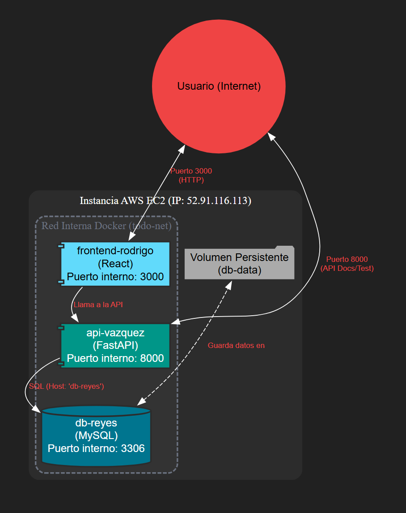
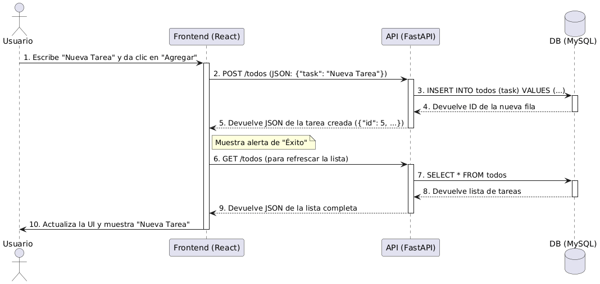

# Proyecto: Arquitectura de Microservicios con Docker Compose

**Autor:** Rodrigo Vázquez Reyes
**Materia:** Sistemas Operativos
**Profesor:** José Alonso Macías Montoya

---

## 🚀 Enlaces del Proyecto

* **Deploy en AWS:** [http://52.91.116.113:3000](http://52.91.116.113:3000)
* **Documentación de la API (Swagger):** [http://52.91.116.113:8000/docs](http://52.91.116.113:8000/docs)
* **Endpoint Requisito (Apellido):** [http://52.91.116.113:8000/vazquez](http://52.91.116.113:8000/vazquez)
* **Repositorio GitHub:** [https://github.com/TRoyGms/DockerCompose.git](https://github.com/TRoyGms/DockerCompose.git)

---

## 1. Visión General del Proyecto 📝

Este proyecto implementa una arquitectura de microservicios usando Docker Compose para una aplicación "To-Do List". El objetivo es demostrar la orquestación de contenedores, redes internas, volúmenes persistentes y dependencias. Integra:

* **Frontend:** React (Vite).
* **Backend:** API REST con FastAPI (Python).
* **Base de Datos:** MySQL 8.0.

La aplicación permite crear, leer, actualizar (texto y estado completado) y eliminar tareas, con persistencia de datos y una interfaz de usuario interactiva. Ha sido desplegada en AWS EC2.

---

## 2. Arquitectura de Servicios 🏗️

La arquitectura consiste en tres servicios principales orquestados por `docker-compose.yml`, comunicándose a través de la red interna `todo-net`.

* **`frontend-rodrigo` (React):**
    * Interfaz de usuario construida con React (Vite).
    * Imagen personalizada basada en `node:20-slim` usando `serve` para servir el contenido estático (`dist`).
    * Expone el puerto **3000**.
    * Consume la API `api-vazquez` en el puerto 8000.
    * Depende de `api-vazquez`.

* **`api-vazquez` (FastAPI):**
    * API REST que maneja la lógica de negocio y operaciones CRUD.
    * Imagen personalizada basada en `python:3.10-slim`, instalando dependencias desde `requirements.txt` y ejecutando con `uvicorn`.
    * Expone el puerto **8000**.
    * Se conecta a la base de datos usando el nombre de host `db-reyes`.
    * Depende de `db-reyes`.
    * Utiliza variables de entorno (`DB_HOST`, `DB_USER`, etc.) inyectadas por Docker Compose.

* **`db-reyes` (MySQL):**
    * Servicio de base de datos que almacena las tareas.
    * Usa la imagen oficial `mysql:8.0`.
    * Expone el puerto **3306** para depuración.
    * Utiliza un volumen nombrado `db-data` para persistencia en `/var/lib/mysql`.
    * Ejecuta scripts de inicialización (`.sql`) desde la carpeta `mysql-init` para crear la tabla `todos` al inicio.

---

## 3. Diagramas 📊

### Diagrama de Arquitectura

Este diagrama ilustra los componentes y sus interconexiones.



### Diagrama de Flujo (Crear Tarea)

Este diagrama de secuencia muestra el flujo de datos al crear una tarea.



---

## 4. Cómo Levantar el Entorno 🚀

**Requisitos:**
* `git`
* `docker`
* `docker-compose-plugin` (o `docker-compose` versión 1)

**Pasos:**

1.  **Clonar el repositorio:**
    ```bash
    git clone [https://github.com/TRoyGms/DockerCompose.git](https://github.com/TRoyGms/DockerCompose.git)
    ```
2.  **Entrar a la carpeta:**
    ```bash
    cd DockerCompose
    ```
3.  **Levantar los servicios:**
    ```bash
    docker compose up --build -d
    ```
    * `--build`: Construye las imágenes personalizadas la primera vez o si los Dockerfiles cambian.
    * `-d`: Ejecuta los contenedores en segundo plano.

**Acceso:**
* **Frontend:** [http://localhost:3000](http://localhost:3000) (o `http://<IP-DEL-SERVIDOR>:3000`)
* **API (Docs):** [http://localhost:8000/docs](http://localhost:8000/docs) (o `http://<IP-DEL-SERVIDOR>:8000/docs`)

---

## 5. Pruebas y Verificación ✅

### Prueba de Persistencia (Volumen)

Para confirmar que los datos sobreviven reinicios:
1.  Inicia la aplicación (`docker compose up -d`).
2.  Abre el frontend y **agrega una tarea**.
3.  Reinicia los contenedores: `docker compose restart`.
4.  Refresca el frontend.

**Resultado Esperado:** La tarea agregada debe permanecer visible, confirmando el funcionamiento del volumen `db-data`.

### Prueba de Comunicación (Red Interna)

* El frontend carga correctamente datos (como el nombre del desarrollador) desde la API, demostrando la conexión `frontend -> api`.
* La API puede leer y escribir tareas en la base de datos usando el nombre de servicio `db-reyes` como host, demostrando la conexión `api -> db` a través de la red Docker.

### Prueba de Requisitos Específicos

* El nombre "Rodrigo Vazquez Reyes" se muestra en el título del frontend.
* Acceder al endpoint `/vazquez` de la API devuelve el nombre completo.

---

## 6. Checklist de Requisitos 📋

| Categoría   | Requisito                  | Cumplimiento                                                                                                 |
| :---------- | :------------------------- | :----------------------------------------------------------------------------------------------------------- |
| **Frontend**| Servicio web (React)       | ✅ Se usa React (Vite) en `frontend-rodrigo`.                                                      |
|             | Consume API REST           | ✅ Llama a la API FastAPI para CRUD completo.                                                      |
|             | Puerto 80 o 3000           | ✅ Expone el puerto **3000**.                                                                       |
|             | **No** Nginx pre-construido| ✅ Dockerfile usa build multi-etapa con `node:20-slim` y `serve`.                                  |
|             | Nombre en Frontend         | ✅ Carga "Rodrigo Vazquez Reyes" desde `/vazquez`.                                                    |
| **Backend** | API REST (Python)          | ✅ Se usa FastAPI en `api-vazquez`.                                                                |
|             | Conectado a DB (CRUD)      | ✅ Endpoints GET, POST, PUT, PATCH, DELETE para tareas.                                          |
|             | Puerto 5000 o 8000         | ✅ Expone el puerto **8000**.                                                                       |
|             | Variables de Entorno       | ✅ Usa `os.getenv()` para `DB_HOST`, `DB_USER`, etc. del `docker-compose.yml`.                         |
|             | Dockerfile personalizado   | ✅ Tiene `Dockerfile` propio con `python:3.10-slim`.                                               |
|             | Tu nombre en la BD         | ✅ La base de datos se llama `rodrigo_db`.                                                       |
|             | Endpoint con tu apellido   | ✅ `GET /vazquez` retorna el nombre completo.                                                         |
| **DB** | MySQL o PostgreSQL         | ✅ Usa imagen `mysql:8.0`.                                                                         |
|             | Persistencia de datos      | ✅ Usa volumen `db-data:/var/lib/mysql`.                                                      |
|             | No volúmenes anónimos    | ✅ Volumen `db-data` definido explícitamente en `volumes:`.                                         |
| **Compose** | 3 servicios                | ✅ Define `frontend-rodrigo`, `api-vazquez`, `db-reyes`.                                        |
|             | Redes internas             | ✅ Servicios en red `todo-net`; API usa `db-reyes` como host.                                         |
|             | Nombres de contenedor      | ✅ `frontend-rodrigo`, `api-vazquez`, `db-reyes`.                                                    |
|             | `depends_on`               | ✅ Establece orden de arranque (`frontend` > `api` > `db`).                                        |
|             | Dockerfiles propios        | ✅ `frontend` y `backend` tienen `Dockerfile` propio.                                              |

---

## 7. Justificación de Imágenes Base 🖼️

* **Backend (`python:3.10-slim`):** Se prefiere sobre `alpine` por mayor compatibilidad con librerías Python (`mysql-connector`, etc.), resultando en instalaciones (`pip install`) más rápidas y fiables al usar 'wheels' precompiladas para Debian (`slim`).
* **Frontend (`node:20-slim`):** Se usa la versión LTS más reciente para optimizaciones y seguridad. La variante `slim` (Debian) ofrece mejor compatibilidad con el ecosistema Node (como `serve`) que `alpine`.

---

## 8. Referencias 📚

* [Docker Compose Documentation](https://docs.docker.com/compose/)
* [React Documentation](https://react.dev/)
* [FastAPI User Guide](https://fastapi.tiangolo.com/)
* [MySQL 8.0 Reference Manual](https://dev.mysql.com/doc/refman/8.0/en/)
* [Vite Documentation](https://vitejs.dev/)
